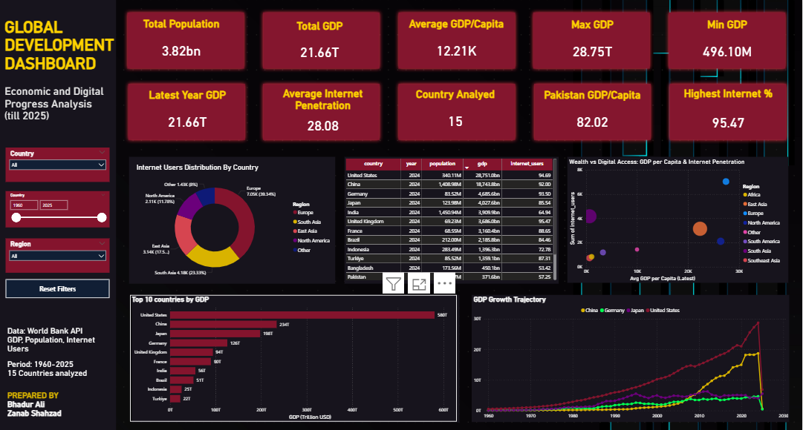
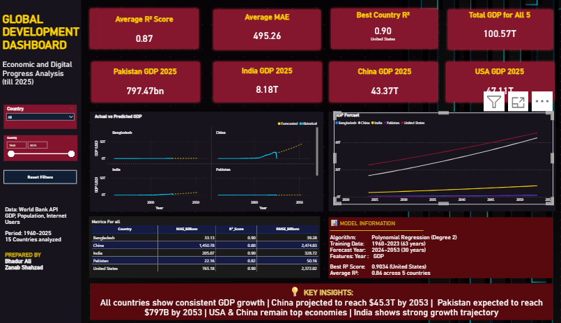

# 🌍 Global Development Dashboard — Power BI + ML Forecasting


---

## 📌 Project Overview

A two-part end-to-end data analytics and machine learning project analyzing **global economic and digital development** across 16 countries from 1960–2025.

**Part 1 — Interactive Power BI Dashboard** connects live to the World Bank Open Data API, performs a full ETL pipeline, and visualizes economic and digital development trends through an interactive dashboard with 10 KPIs and 5 chart types.

**Part 2 — ML GDP Forecasting** extends the dashboard with a Polynomial Regression model trained in Python that predicts GDP for 5 major economies over the next 30 years (2024–2053), integrated back into Power BI as a dedicated predictive analytics page.

---

## 🖼️ Dashboard Preview

### Part 1 — Global Development Dashboard

**Full Dashboard**


---

### Part 2 — Predictive Analytics Dashboard

**Full Predictive Dashboard — 30-Year GDP Forecast**


---

## 📁 Repository Structure

```
global-development-powerbi-dashboard/
│
├── powerbi/
│   └── worldbank.pbix                        # Power BI dashboard file
│
├── code/
│   └── main.py                               # Python ML forecasting script
│
├── reports/
│   ├── global-development-dashboard-report.docx   # Part 1 technical report
│   └── gdp-forecasting-ml-report.docx             # Part 2 ML technical report
│
├── screenshots/
│   ├── dashboard_full.png
│   ├── dashboard_kpis.png
│   ├── dashboard_charts.png
│   ├── dashboard_slicers.png
│   ├── predictive_full.png
│   └── predictive_actual_vs_predicted.png
│
└── README.md
```

---

## 📡 Data Source

**[🌐 World Bank Open Data API](https://data.worldbank.org/)** — 3 live indicators:

> All data is publicly available and free to use. Direct API base URL: `https://api.worldbank.org/v2/`

| Indicator | API Code | Records | Period |
|---|---|---|---|
| Total Population | [`SP.POP.TOTL`](https://api.worldbank.org/v2/country/all/indicator/SP.POP.TOTL?format=json&per_page=20000) | ~17,500 | 1960–2025 |
| GDP (Current US$) | [`NY.GDP.MKTP.CD`](https://api.worldbank.org/v2/country/all/indicator/NY.GDP.MKTP.CD?format=json&per_page=20000) | ~17,500 | 1960–2025 |
| Internet Users (%) | [`IT.NET.USER.ZS`](https://api.worldbank.org/v2/country/all/indicator/IT.NET.USER.ZS?format=json&per_page=20000) | ~17,556 | 1960–2025 |

**16 Countries:** Pakistan · India · Bangladesh · Sri Lanka · Nepal · China · Japan · United States · United Kingdom · Germany · France · Brazil · Nigeria · Indonesia · Turkey · Saudi Arabia

---

## 🔧 Part 1 — Power BI Dashboard

### Step 1 — Data Import

Connected Power BI directly to the World Bank API using the native **Web Connector**. Three separate queries were created — one per indicator. The `per_page=20000` parameter ensured complete data retrieval in a single API call without pagination. Each JSON response was parsed and converted into structured tables using Power Query's built-in JSON handler.

### Step 2 — Data Transformation (Power Query)

- **Column renaming** — default API field names replaced with meaningful identifiers: `Country`, `CountryCode`, `Year`, `GDP`, `Population`, `InternetUsers`
- **Regional aggregate removal** — World Bank includes non-country aggregates like "Arab World" and "European Union" — these were filtered out using keyword matching to keep only sovereign nations
- **Data type conversion** — `Year` converted to Whole Number; `GDP`, `Population`, `InternetUsers` converted to Decimal
- **Null handling** — internet data pre-2000 filled using Fill Up; GDP/Population nulls handled with Fill Down; remaining nulls replaced with zero

### Step 3 — Data Modeling

The three cleaned queries were merged into a single `Final Table` using a **composite key** of `CountryCode + Year` with a Full Outer Join. Two calculated columns were added:
- **Region** — geographic categorization (South Asia, East Asia, Europe, etc.)
- **GDP per Capita** — GDP ÷ Population for each country-year row

### Step 4 — DAX Measures (12 total)

| Category | Measures |
|---|---|
| Summary | Total Population, Total GDP, Avg GDP per Capita, Avg Internet Penetration |
| Extremum | Max GDP, Min GDP, Highest Internet % |
| Country-Specific | Pakistan GDP per Capita, Latest Year GDP, Country Count |
| Analytical | GDP Growth %, GDP Rank |

### Step 5 — Dashboard Design

**Canvas:** 2160 × 1170px · Dark professional theme

| Section | Content |
|---|---|
| Left Sidebar | Country slicer · Region slicer · Year range slider (2000–2025) · Reset Filters button |
| Row 1 | 10 KPI cards — Total Population, Total GDP, Avg GDP/Capita, Max GDP, Min GDP, Pakistan GDP/Capita, Highest Internet %, Latest Year GDP, Avg Internet Penetration, Countries Analyzed |
| Row 2 | Donut chart (Internet by Region) · Matrix table (Country-wise indicators) · Scatter plot (GDP per Capita vs Internet %) |
| Row 3 | Bar chart (Top 10 Countries by GDP) · Line chart (GDP Growth Trajectory 2000–2025) |

All visuals support **full cross-filtering** — selecting any country, region, or year updates the entire dashboard dynamically.

---

## 🤖 Part 2 — ML GDP Forecasting

### Model Selection

After evaluating ARIMA, XGBoost, and Linear Regression, **Polynomial Regression (degree=2)** was selected as the best fit for this dataset. With only 63 data points per country, simpler models outperform complex ones. The degree-2 polynomial captures non-linear upward GDP trends while avoiding overfitting.

### Feature Engineering

| Original Feature | Engineered Features | Purpose |
|---|---|---|
| Year | Year (linear) | Captures steady growth |
| Year | Year² (quadratic) | Captures acceleration/deceleration |

### Training (Python / Google Colab) — [`code/main.py`](./code/main.py)

```python
from sklearn.preprocessing import PolynomialFeatures
from sklearn.linear_model import LinearRegression

X = country_data[['year']].values
y = country_data['gdp'].values

poly = PolynomialFeatures(degree=2)
X_poly = poly.fit_transform(X)

model = LinearRegression()
model.fit(X_poly, y)

# Forecast 2024–2053
future_years = np.array(range(2024, 2054)).reshape(-1, 1)
predictions = model.predict(poly.transform(future_years))
```

Model trained separately per country using full 1960–2023 historical data. Forecast CSVs exported and re-imported into Power BI to build the predictive dashboard page.

### Model Performance

| Country | R² Score | MAE (Billion USD) | RMSE (Billion USD) |
|---|---|---|---|
| United States | 0.9034 | 765.18 | 2,372.02 |
| Bangladesh | 0.9003 | 33.13 | 39.28 |
| India | 0.8994 | 205.07 | 328.72 |
| Pakistan | 0.8233 | 22.16 | 50.16 |
| China | 0.8029 | 1,450.78 | 2,474.83 |
| **Average** | **0.8659** | **495.26** | **1,053.00** |

### 30-Year GDP Forecast (2024–2053)

| Year | Pakistan | India | China | USA | Bangladesh |
|---|---|---|---|---|---|
| 2024 | $345.5B | $3.8T | $18.5T | $27.8T | $475.2B |
| 2030 | $423.7B | $5.1T | $24.2T | $32.1T | $571.7B |
| 2040 | $571.7B | $7.1T | $33.8T | $37.9T | $723.4B |
| 2053 | $797.5B | $9.8T | $45.3T | $44.2T | $928.6B |

### ML → Power BI Integration Pipeline

```
World Bank API
      ↓
Power BI (ETL + Final Table)
      ↓
Export final_table.csv
      ↓
Python / Google Colab (Train Model + Generate Forecasts)
      ↓
Export: forecasts.csv + model_metrics.csv
      ↓
Power BI (Import → Predictive Analytics Page)
```

---

## 🔑 Key Findings

**1. Digital-Economic Correlation**
Strong positive correlation between GDP per capita and internet penetration — confirmed by scatter plot analysis. Digital infrastructure and economic growth are mutually reinforcing.

**2. China's Dominance**
Most dramatic GDP growth of any country — $1.2T (2000) → $17.7T (2023). Model projects China to surpass the USA as world's largest economy around **2048**.

**3. Pakistan's Digital Opportunity**
With 231M population and only 35.2% internet penetration, Pakistan is one of the world's largest untapped digital markets — projected to add ~80M new internet users by 2030.

**4. Leapfrog Development**
South Asian countries show rapid mobile-first internet adoption, bypassing fixed-line broadband — Pakistan grew from 0.4% (2000) to 35.2% (2023) internet penetration.

**5. Regional Disparity**
Europe/North America: 85%+ internet penetration vs South Asia/Africa: 35–45% — a significant digital divide that correlates directly with economic output.

---

## ⚙️ Tools & Technologies

| Tool | Purpose |
|---|---|
| Microsoft Power BI Desktop | Dashboard, ETL, DAX, data modeling |
| Power Query Editor | Data transformation and cleaning |
| DAX | KPI measures and calculated columns |
| Python (Google Colab) | ML model training |
| scikit-learn | Polynomial Regression |
| pandas / numpy | Data manipulation |
| matplotlib | Model evaluation plots |
| World Bank Open Data API | Live data source |

---

## 📂 Files & Reports

| File | Description |
|---|---|
| [`powerbi/worldbank.pbix`](./powerbi/worldbank.pbix) | Power BI dashboard — open in Power BI Desktop |
| [`code/main.py`](./code/main.py) | Python ML forecasting script |
| [`reports/global-development-dashboard-report.docx`](./reports/global-development-dashboard-report.docx) | Full technical report — Part 1 (ETL, DAX, dashboard design, results) |
| [`reports/gdp-forecasting-ml-report.docx`](./reports/gdp-forecasting-ml-report.docx) | Full technical report — Part 2 (ML model, evaluation, forecasts) |

---

## 👨‍💻 Author

**Bhadur Ali** — Data Analyst & Junior Data Scientist

MS Data Science · PAF-IAST

[](https://linkedin.com/in/bhadur-ali)
[](mailto:alikhansalar5@gmail.com)
[](https://github.com/BhadurAli)
